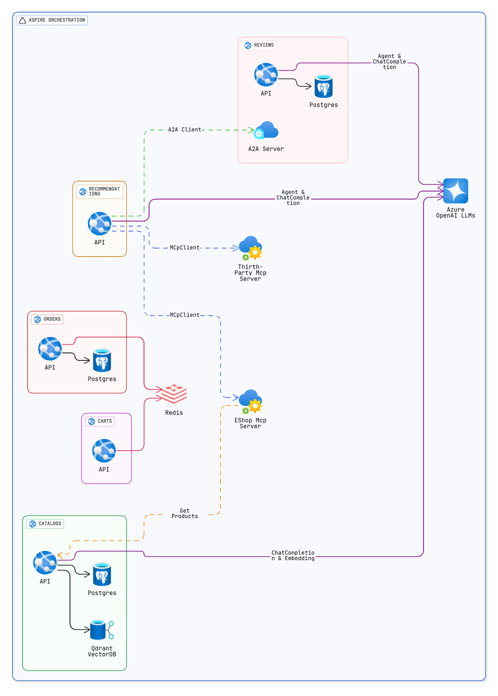

# GenAI-Eshop-Semantic-Kernel

> 💡 Practical `GenAI-Eshop` application using [Semantic Kernel](https://github.com/microsoft/semantic-kernel), `multi-agent orchestrations`, `Mcp tools`, `A2A Agents`, `Semantic Search` and more.

> [!NOTE]
> We will migrate this `GenAI-Eshop` application to the [microsoft/agent-framework](https://github.com/microsoft/agent-framework) instead of [Semantic Kernel](https://github.com/microsoft/semantic-kernel) in a [sepereated repository](https://github.com/mehdihadeli/genai-eshop). You can check their differences in a practical application here.

## Features

- ✅ Using `Qdrant` Semantic Kernel Connector for storing vector data for doing `Semantic Meaning Search` and `Hybrid Search` using vector data and semantic kernel
- ✅ Using Semantic Kernel `EmbeddingGenerator` based on chosen providers like `Ollama`, `AzureOpenAI`, and `OpenAI` for generating vector data for semantic search
- ✅ Using Semantic Kernel `ChatCompletion` based on chosen providers like `Ollama`, `AzureOpenAI`, and `OpenAI` for communicating with different models for generating responses
- ✅ Using `Mcp tools` based on `http` and json-rpc for calling endpoints in our Mcp server and calling third party tools by LLMs for Fine-grained functions
- ✅ Using `Multi-Agent Orchestrations` for `local` and `external` agents communication using agents `parent child agent relationships` and different Semantic Kernel’s `Agent Orchestration Patterns` like GroupChat and Sequential orchestration
- ✅ Using `Agent2Agent Protocol (A2A)` protocol based on http and json-rpc for calling and using external agents
- ✅ Using `Vertical Slice Architecture` as a high-level architecture
- ✅ Using `Minimal APIs` for handling requests
- ✅ Using `OpenTelemetry` for collecting `Logs`, `Metrics` and `Distributed Traces`
- ✅ Using `.NET Aspire` for cloud-native application orchestration and enhanced developer experience

## Architecture Diagram



## Getting Started

### Prerequisites

- [.NET 9.0 SDK](https://dotnet.microsoft.com/download/dotnet/)
- [Docker](https://www.docker.com/get-started)
- [Aspire CLI](https://learn.microsoft.com/en-us/dotnet/aspire/cli/install)

### Install an IDE

You can use any of the following IDEs for development:

- **[JetBrains Rider](https://www.jetbrains.com/rider/)** (Recommended)
- **[Visual Studio 2022](https://visualstudio.microsoft.com/)**
- **[Visual Studio Code](https://code.visualstudio.com/)**

Ensure the IDE includes support for .NET Core and plugins for C#.

### Run Application

#### Aspire

Install the [`Aspire CLI`](https://learn.microsoft.com/en-us/dotnet/aspire/cli/install?tabs=windows) tool:

```bash
# Bash
dotnet tool install -g Aspire.Cli
```

To run the application using the `Aspire App Host` and using Aspire dashboard in the development mode run following command:

```bash
aspire run
```

> Note:The `Aspire dashboard` will be available at:
> `https://localhost:17056` and `http://localhost:15234`

#### Using Docker-Compose

```bash
# Start docker-compose
docker-compose -f .\deployments\docker-compose\docker-compose.yaml up -d

# Stop docker-compose
docker-compose -f .\deployments\docker-compose\docker-compose.yaml down
```

This command will run the required infrastructure for the application

Open the solution file [genai-eshop-semantic-kernel.sln](./genai-eshop-semantic-kernel.sln) in your preferred IDE (e.g., Rider or Visual Studio).

Now you can run each microservice using the IDE.

## License

The project is under [MIT license](https://github.com/mehdihadeli/genai-eshop-semantic-kernel/blob/main/LICENSE).
